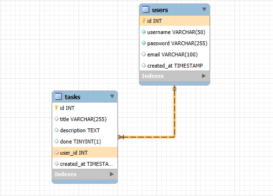

# desafio-essentia-tecnologies 📝 To-Do List - Aplicação Web

Uma aplicação web simples e eficiente para gerenciamento de tarefas diárias, com autenticação de usuários.

## 🧰 Tecnologias Utilizadas

- **Frontend:** Angular
- **Backend:** Node.js + Express + TypeScript
- **Banco de Dados:** MySQL
- **Autenticação:** JWT (JSON Web Token) - Melhoria

---

## 📁 Estrutura de Pastas

to-do-app/

├── frontend/ → Aplicação Angular

├── backend/ → API Node.js com TypeScript

---

## Estrutura do banco de dados


---

## Para executar o projeto localmente

### Pré-requisitos

- Node.js instalado (v16+ recomendado)
- Angular CLI (`npm install -g @angular/cli`)
- MySQL instalado e rodando

---

### Passos para rodar o Frontend

No bash:
```
cd frontend
npm install
ng serve
```
O frontend estará disponível em: http://localhost:4200

### Passos para rodar o Backend
No bash:
```
cd backend
npm install
npm run dev
```

## Setup
 Crie o arquivo `.env` com as variáveis de conexão com o MySQL

# Funcionalidades
-- Autenticação JWT (upgrade futuro)

-- CRUD de tarefas

-- Cada usuário visualiza apenas suas tarefas

# Testes
Os testes podem ser feitos manualmente no navegador e via Postman/Insomnia.

📌 Observações
O projeto está em desenvolvimento.